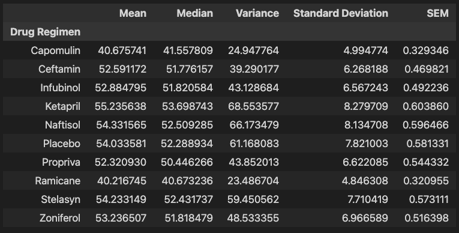
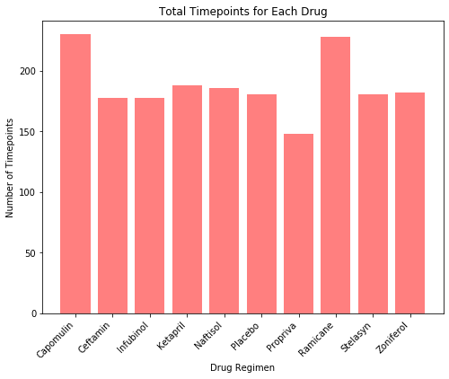
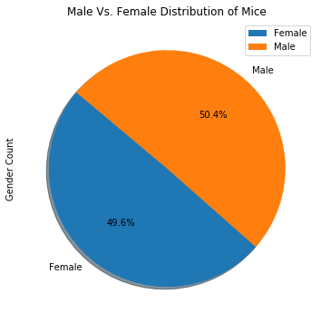
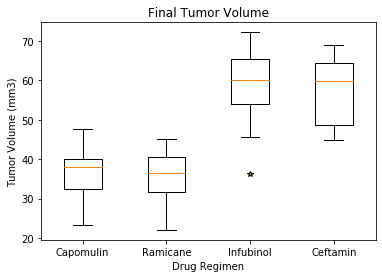
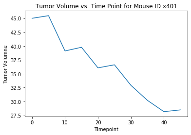
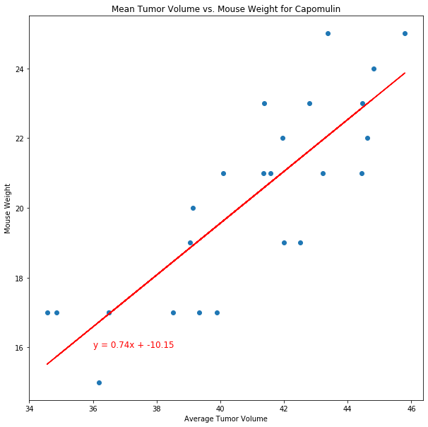

# Pymaceuticals

In a study involving 249 mice with SCC tumor growth, treated through a variety of drug regimens over the course of 45 days, tumor development was observed and measured. The purpose of this study was to compare the performance of Pymaceuticals' drug of interest, Capomulin, versus the other treatment regimens. 

After cleaning the data by removing duplicates, tables and figures for the report of the study were generated. 

# Visuals
A Summary Statistics Table: 
 

Bar plot showing the total number of timepoints for all mice tested for each drug regimen throughout the course of the study: 
 

A pie plot showing the distribution of female or male mice: 
 

Then, the final tumor volume of each mouse across four of the most promising treatment regimens (Capomulin, Ramicane, Infubinol, and Ceftamin) was found.

Box and whisker plot of the final tumor volume for the four most promising treatment regimens: 
 

A random mouse that was treated with Capomulin was selected. 
Here is a line plot of tumor volume vs. time point for that mouse. 
 

Scatter plot of tumor volume versus mouse weight for the Capomulin treatment regimen, with correlation coefficient and linear regression model between mouse weight and average tumor volume: 
 

# Observations and Inferences

1. There is a positive correlation between mouse weight and average tumor volume. As mouse weight increases, so does the mean tumor volume. 

2. Capomulin has the second smallest standard deviation, mean, and median of tumor volume out of all the drugs, with Ramicane having the smallest in all these categories. 

2. Capomulin has the smallest interquartile range out of these 4 drugs: Capomulin, Ramicane, Infubinol, and Ceftamin.
